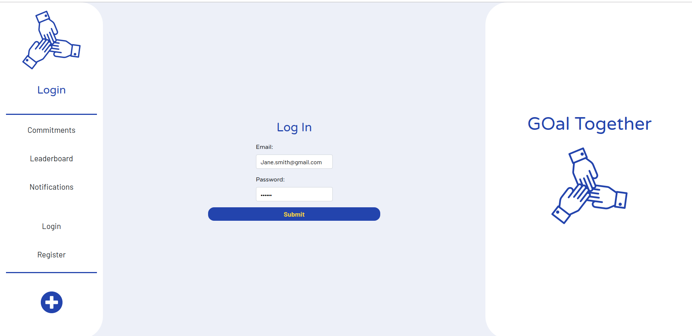
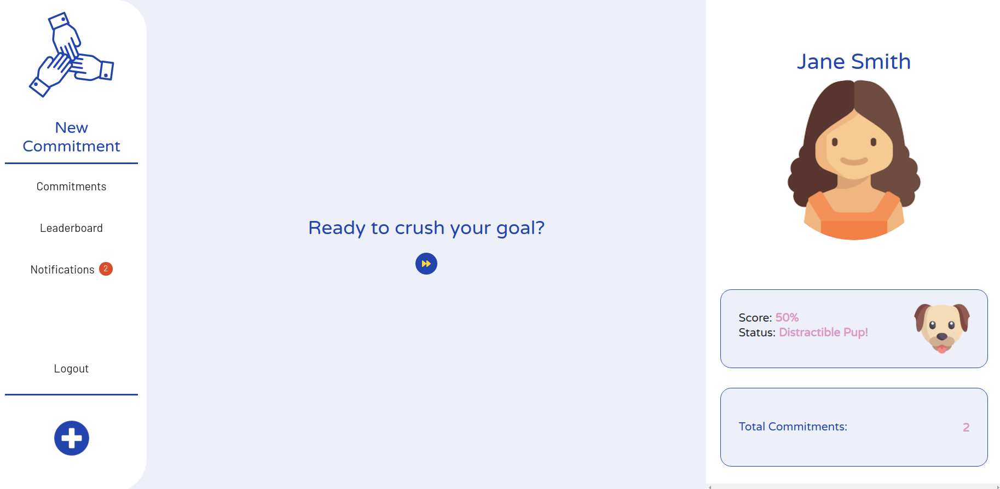
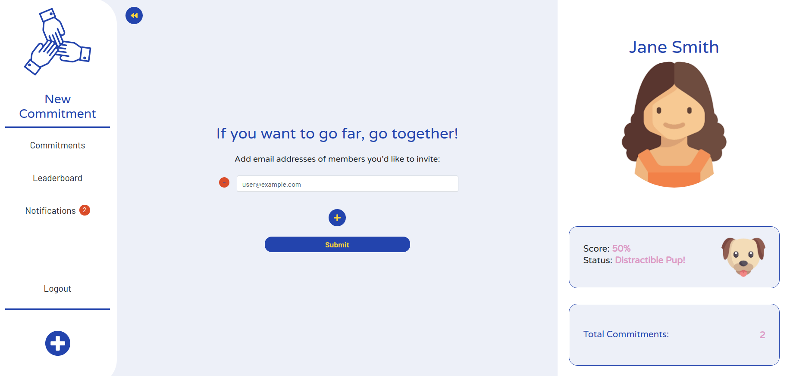
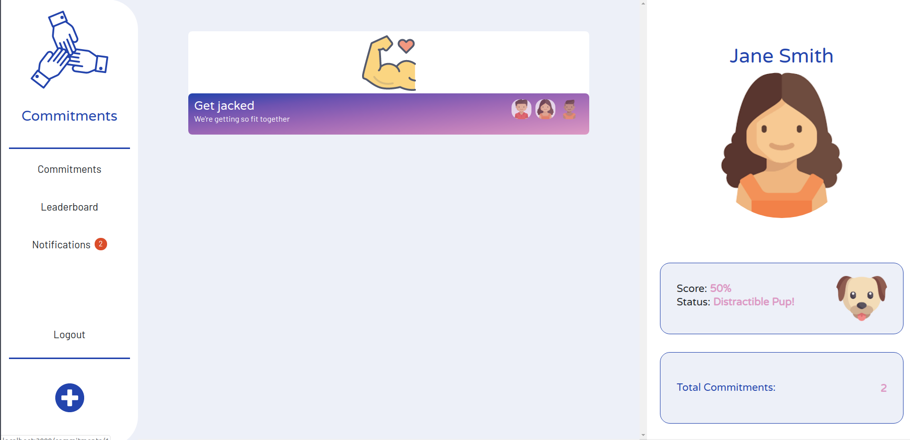
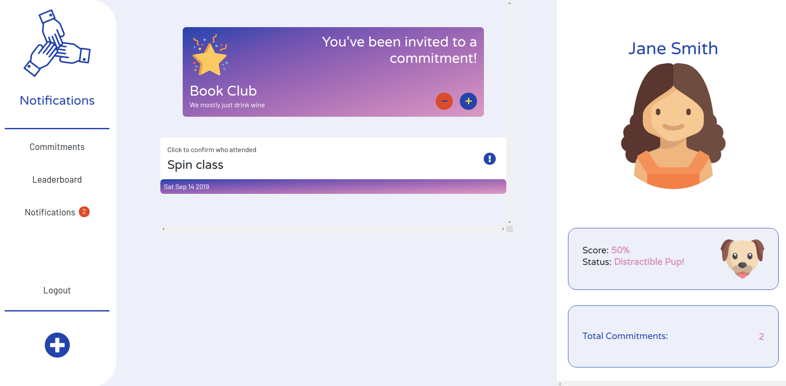
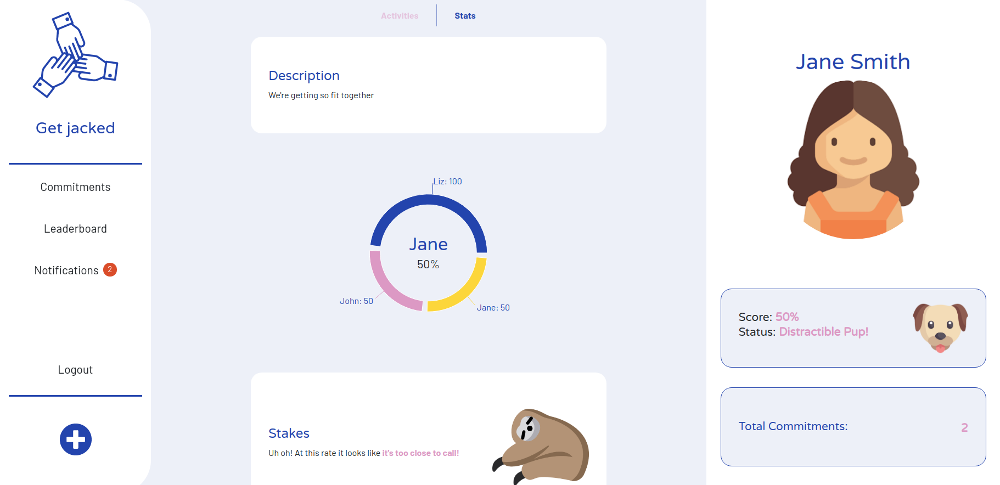
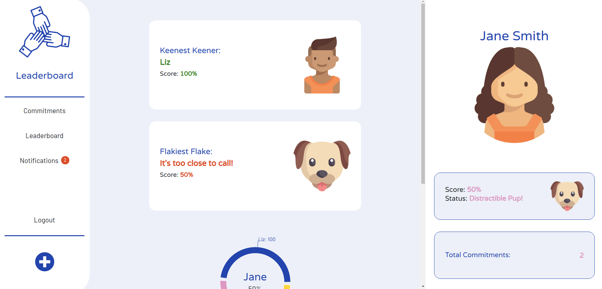
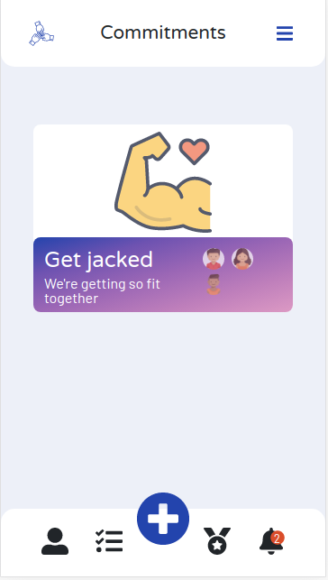
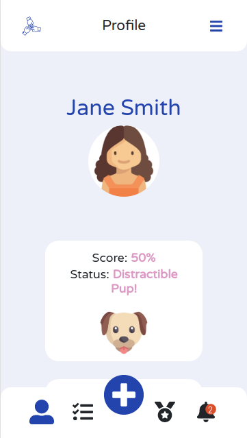

# GOal Together - LHL Final Project

GOal Together is a social motivation app that empowers users by empowering their friends to hold them accountable to their goals. 

GOal Together allows users to create, manage, and invite friends to commitments. A commitment can be really anything! Whether it's a study group, a gym group, a book club, or whatever other commitment you want to make to yourself to actualize your ideal self! 

The app is centered on the power of social encouragement. Users are able to vote on whether fellow members actually attended and did what they said they were going to. The fun interface encourages accountability because:

### If you want to go fast, go alone. 

### If you want to go far, GOal Together

## Setup

The app uses a Rails API server and a React/React Router client front end. 

### API Server

From the terminal, select the api_server directory with `cd api_server`.

Install dependencies with `bundle install`.

Create a new env file titled `.env`.

In the file, update cr

```
POSTGRES_USER='labber'
POSTGRES_PASSWORD='labber'
POSTGRES_HOST='localhost'
POSTGRES_DB='final_project'
POSTGRES_TEST_DB='your_database_name_test'

GMAIL_USERNAME=<your username here>
GMAIL_PASSWORD=<your password here>
```

### Client

From the terminal, select the client directory with `cd client`.

Install dependencies with `npm install`.

Create a new env file title `.env`.

```
REACT_APP_BASE_URL=http://localhost:3000
REACT_APP_API_URL=http://localhost:3001/api
REACT_APP_CLOUD_NAME=dsyrby0kb
REACT_APP_PRESET=ovfn6v7o
```

## How to Use

1. Home page on desktop! Login authentication is handled using JWT.


2. Users can create their first commitment by clicking the bottom left + icon. Once a user creates a commitment, they can create activities (e.g. study session, body pump class, book club meeting, etc.) on a given date. The app will notify members of the commitment that an activity is coming up. 


3. Invites are send using ActiveMailer from your configured Gmail Account.


4. Once created, you can view your commitments on the commitments page.


5. Create, track, and vote on activities and join commitments via the notifications page!


6. View your stats for a commitment and see who is ahead and who is falling behind!


7. Track how you rank against your friend and find out who is the Keenest Keener on the leaderboard page!


8. Oh and did we mention is responsive? It's responsive...




## Dependencies

Client:
- React
- Classnames
- FontAwesome
- Bootstrap
- Axios
- Normalize
- Cloudinary
- Recharts

API:
- Rack-cors
- Knock
- PG
- Dotenv
- Bcrypt
